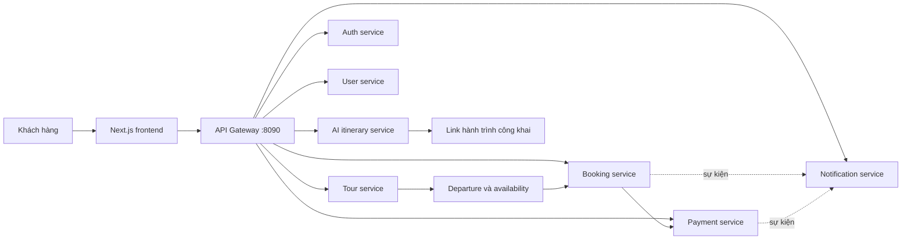

# Việt Khám Phá — Frontend

Giao diện khách hàng cho nền tảng đặt tour nội địa và lập lịch trình tự túc bằng AI. Sản phẩm tập trung vào trải nghiệm du lịch Việt Nam có chiều sâu, minh bạch về lịch khởi hành, giá, thành phần gói tour và dự toán hành trình.

> Đây là frontend của hệ thống Việt Khám Phá. Backend được phát triển ở repository [`journeyai`](https://github.com/trinhxuanhuan/journeyai).

## Phạm vi MVP

- Khám phá, lọc và xem chi tiết Tour ghép hoặc Tour riêng.
- Xem Departure thật, số chỗ còn lại và giá áp dụng cho từng ngày khởi hành.
- Đặt tour với danh sách người tham gia, phụ thu phòng đơn và tùy chọn hướng dẫn viên phù hợp loại Tour.
- Thanh toán VNPay, theo dõi Booking và yêu cầu hủy theo policy snapshot.
- Nhận thông báo trong ứng dụng, đánh dấu đã đọc và cấu hình email.
- Quản lý danh tính, thông tin liên hệ, avatar và sở thích trong Account Center.
- Tạo, lưu, tinh chỉnh và chia sẻ hành trình tự túc bằng AI kèm dự toán, cảnh báo và chỉ số chất lượng.

Khách sạn, phòng, xe, bữa ăn, vé tham quan và bảo hiểm là thành phần của package Tour; dự án không xây một OTA hoặc inventory nhà cung cấp riêng.

## Luồng nghiệp vụ chính



Frontend và backend là hai repository độc lập, giao tiếp qua contract `/v1/**` tại API Gateway. Contract nghiệp vụ chi tiết nằm trong `docs/MVP_API_CONTRACT.md` của backend.

## Công nghệ

- Next.js 16 App Router, React 19 và TypeScript strict.
- Tailwind CSS 4, shadcn/base-ui và Framer Motion.
- React Hook Form + Zod cho form và validation.
- Axios cho API client; Vitest cho unit test.
- GitHub Actions chạy test, lint và production build trên mọi pull request vào `main`.

## Các route quan trọng

| Route | Chức năng |
| --- | --- |
| `/` | Tìm kiếm, lọc và khám phá tour |
| `/tours/[tourId]` | Chi tiết package, lịch trình và Departure |
| `/dat-tour/[tourId]` | Checkout Tour ghép/Tour riêng |
| `/bookings` | Danh sách booking của khách hàng |
| `/bookings/[bookingId]` | Chi tiết, thanh toán và hủy booking |
| `/thong-bao` | Trung tâm thông báo và tùy chọn email |
| `/tai-khoan` | Hồ sơ tài khoản, liên hệ, avatar và sở thích du lịch |
| `/lap-lich-trinh` | Tạo hành trình tự túc bằng AI |
| `/hanh-trinh` | Các hành trình AI đã lưu |
| `/hanh-trinh/chia-se/[shareToken]` | Bản chia sẻ công khai, không lộ dữ liệu chủ sở hữu |

## Chạy local

Yêu cầu Node.js 22 và backend đang chạy tại `http://localhost:8090`.

```powershell
Copy-Item .env.example .env.local
npm ci
npm run dev
```

Mở `http://localhost:3000`. Hai biến môi trường public:

| Biến | Ý nghĩa | Giá trị local |
| --- | --- | --- |
| `NEXT_PUBLIC_API_URL` | Địa chỉ API Gateway | `http://localhost:8090` |
| `NEXT_PUBLIC_SITE_URL` | Origin chuẩn của frontend cho SEO | `http://localhost:3000` |

Không đưa secret, khóa VNPay hoặc thông tin hạ tầng riêng vào biến `NEXT_PUBLIC_*` vì chúng được đóng gói xuống trình duyệt.

## Quality gates

```powershell
npm test
npm run lint
npm run build
```

Giao diện có trạng thái loading/empty/error, hỗ trợ bàn phím, reduced motion, responsive từ mobile đến desktop, branded 404/error boundary và metadata cơ bản cho việc triển khai.

## Kịch bản kiểm thử end-to-end

1. Đăng ký, xác thực OTP, đăng nhập và cập nhật hồ sơ tài khoản.
2. Lọc Tour ghép, chọn Departure còn chỗ, nhập người tham gia và tạo Booking.
3. Khởi tạo VNPay sandbox, quay lại trang kết quả và kiểm tra trạng thái chuẩn từ backend.
4. Mở trung tâm thông báo, đánh dấu đã đọc và thay đổi tùy chọn email.
5. Tạo hành trình AI, khóa một ngày, tinh chỉnh phần còn lại và mở link chia sẻ ở chế độ không đăng nhập.
6. Đặt Tour riêng và xác nhận luồng không reserve shared capacity.

## Cố tình để sau MVP

- Báo giá Tour riêng tùy biến sâu.
- Booking khách sạn, chuyến bay, vé tham quan hoặc inventory nhà cung cấp độc lập.
- Ứng dụng quản trị vận hành hoàn chỉnh.
- Mua dịch vụ trực tiếp từ lịch trình AI.
- Đa ngôn ngữ và native mobile app.
