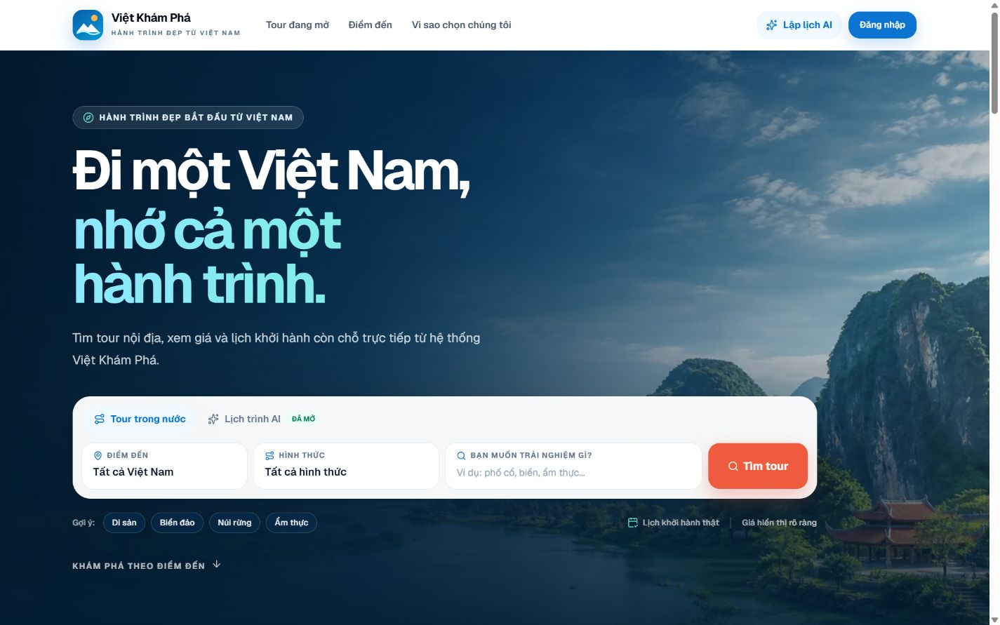
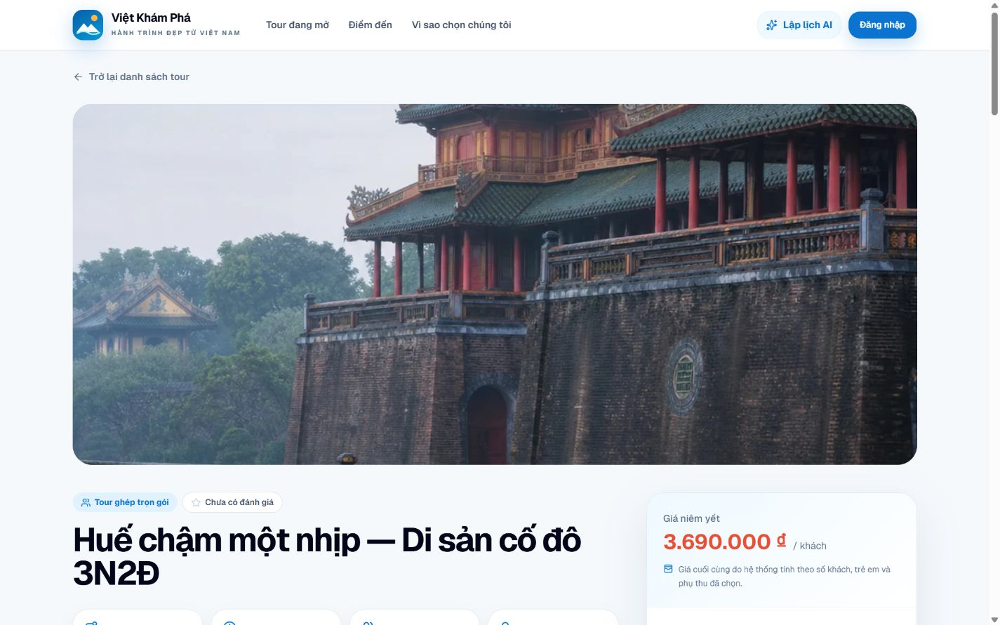
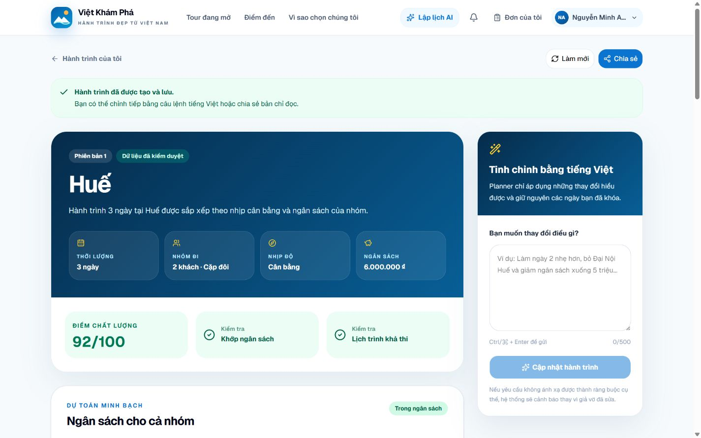
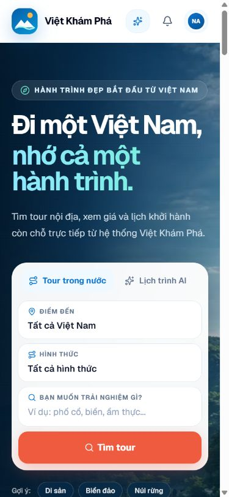
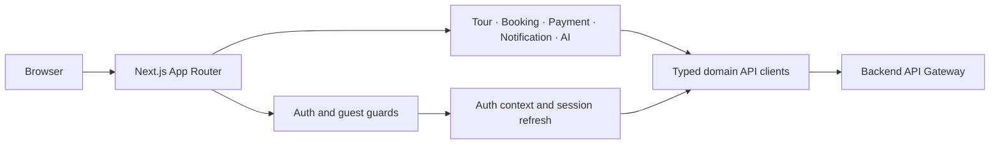

# JourneyAI — Việt Khám Phá Frontend

A modern, responsive Next.js frontend for Vietnam tour booking and AI-assisted itinerary planning.

Việt Khám Phá presents Vietnam as a meaningful journey while keeping departure dates, availability, pricing, package inclusions, and itinerary budgets transparent.

[](https://github.com/trinhxuanhuan/journeyai-frontend/actions/workflows/ci.yml)

**Repositories:** [Backend](https://github.com/trinhxuanhuan/journeyai) · Frontend (this repository)

**Status:** MVP release candidate with unit tests, linting, production builds, and Docker image verification in CI.

## Product screenshots

These screenshots were captured from the running application using the verified tour catalog and local APIs; they are not static mockups.

| Tour discovery | Tour-package details |
| --- | --- |
|  |  |

| Saved AI itinerary | Mobile experience |
| --- | --- |
|  |  |

## Frontend highlights

- **Complete customer journey:** tour discovery, departure selection, checkout, payment, booking tracking, notifications, and account management.
- **Resilient authentication:** route guards, JWT validation, automatic refresh after `401` responses, single-flight refresh, and local-session invalidation when a refresh token is rejected.
- **Contract-oriented API layer:** TypeScript modules are organized by Tour, Booking, Notification, Account, and AI itinerary; React Hook Form and Zod validate user input.
- **Production UX states:** loading, empty, error, payment-result, branded `404`, and global error-boundary experiences cover more than the happy path.
- **Responsive and accessible UI:** keyboard support, semantic status regions, reduced-motion behavior, and layouts that adapt from mobile to desktop.

## MVP scope

- Discover, filter, and inspect scheduled group tours or private tours.
- View real departures, remaining capacity, and date-specific pricing.
- Book tours with participant details, single-room supplements, and guide options appropriate to the tour type.
- Pay through VNPay, track bookings, and request cancellation under the snapshotted policy.
- Receive in-app notifications, manage read state, and configure email preferences.
- Manage identity, contact information, avatar, and travel preferences in the Account Center.
- Create, store, refine, and share AI-assisted itineraries with budgets, warnings, and quality indicators.

Hotels, rooms, transportation, meals, attraction tickets, and insurance are tour-package components. The project does not implement an OTA or standalone supplier inventory.

## Frontend architecture


```mermaid
flowchart LR
  Browser[Browser] --> App[Next.js App Router]
  App --> Guards[Auth and guest guards]
  App --> Features["Tour · Booking · Payment · Notification · AI"]
  Guards --> Session[Auth context and session refresh]
  Features --> Clients[Typed domain API clients]
  Session --> Clients
  Clients --> Gateway[Backend API Gateway]
```

The frontend and backend are maintained in separate repositories. The browser communicates only with the `/v1/**` contract exposed by the API Gateway; business rules and service architecture are documented in the [MVP API contract](https://github.com/trinhxuanhuan/journeyai/blob/main/docs/MVP_API_CONTRACT.md) and [Backend README](https://github.com/trinhxuanhuan/journeyai#readme).

## Technology

- Next.js 16 App Router, React 19, and strict TypeScript
- Tailwind CSS 4, shadcn/base-ui, and Framer Motion
- React Hook Form and Zod for forms and validation
- Axios for API communication and Vitest for unit tests
- GitHub Actions running tests, linting, and production builds on every pull request to `main`

## Key routes

| Route | Purpose |
| --- | --- |
| `/` | Search, filter, and discover tours |
| `/tours/[tourId]` | Tour package, itinerary, and departure details |
| `/dat-tour/[tourId]` | Group/private tour checkout |
| `/bookings` | Customer booking history |
| `/bookings/[bookingId]` | Booking details, payment, and cancellation |
| `/thong-bao` | Notification center and email preferences |
| `/tai-khoan` | Profile, contact details, avatar, and travel preferences |
| `/lap-lich-trinh` | AI-assisted itinerary creation |
| `/hanh-trinh` | Saved AI itineraries |
| `/hanh-trinh/chia-se/[shareToken]` | Public sharing without exposing owner information |

## Run locally

Requires Node.js 22 and the backend running at `http://localhost:8090`.

```powershell
Copy-Item .env.example .env.local
npm ci
npm run dev
```

Open `http://localhost:3000`. The application uses two public environment variables:

| Variable | Purpose | Local value |
| --- | --- | --- |
| `NEXT_PUBLIC_API_URL` | API Gateway base URL | `http://localhost:8090` |
| `NEXT_PUBLIC_SITE_URL` | Canonical frontend origin for SEO | `http://localhost:3000` |

Never place secrets, VNPay keys, or private infrastructure details in `NEXT_PUBLIC_*` variables because their values are bundled into browser-side JavaScript.

## Build and deployment

The frontend supports both managed Next.js platforms and a standalone Docker image. Both `NEXT_PUBLIC_*` variables must be supplied at **build time**; changing runtime variables does not replace URLs already bundled into browser-side JavaScript.

```powershell
docker build `
  --build-arg NEXT_PUBLIC_API_URL=https://api-staging.vietkhampha.vn `
  --build-arg NEXT_PUBLIC_SITE_URL=https://staging.vietkhampha.vn `
  -t viet-kham-pha/frontend:rc .

docker run --rm -p 3000:3000 viet-kham-pha/frontend:rc
```

The image runs as a non-root user, contains only the traced Next.js output, and exposes a health check at `/robots.txt`. The staging backend must configure `CORS_ALLOWED_ORIGIN` to exactly match `NEXT_PUBLIC_SITE_URL`.

Free deployment without purchasing a domain: [docs/VERCEL_STAGING.md](docs/VERCEL_STAGING.md).

After deploying the frontend and backend, run the public smoke test without an account or secret:

```powershell
./scripts/smoke-staging.ps1 `
  -FrontendBaseUrl https://staging.vietkhampha.vn `
  -ApiBaseUrl https://api-staging.vietkhampha.vn
```

The script verifies branding, login, SEO, Gateway health, real tour data, detail pages, CORS, and protected-API enforcement. Authenticated Booking, VNPay, Notification, and AI flows follow the backend end-to-end checklist because they require a managed mailbox and sandbox account.

## Quality gates

```powershell
npm test
npm run lint
npm run build
```

The interface includes loading, empty, and error states; keyboard support; reduced-motion behavior; responsive layouts; branded 404 and error boundaries; and baseline deployment metadata.

## End-to-end scenarios

1. Register, verify the OTP, sign in, and update the account profile.
2. Filter group tours, choose an available departure, enter participant details, and create a booking.
3. Initiate a VNPay sandbox payment, return to the result page, and verify the authoritative backend status.
4. Open the notification center, mark notifications as read, and change email preferences.
5. Generate an AI itinerary, lock one day, refine the remaining days, and open its public link while signed out.
6. Book a private tour and verify that it does not reserve shared departure capacity.

## Deliberately deferred beyond MVP

- Deeply customized private-tour quotations
- Standalone hotel, flight, attraction-ticket, or supplier inventory
- A complete operations administration application
- Direct service purchases from AI-generated itineraries
- Multilingual support and native mobile applications
